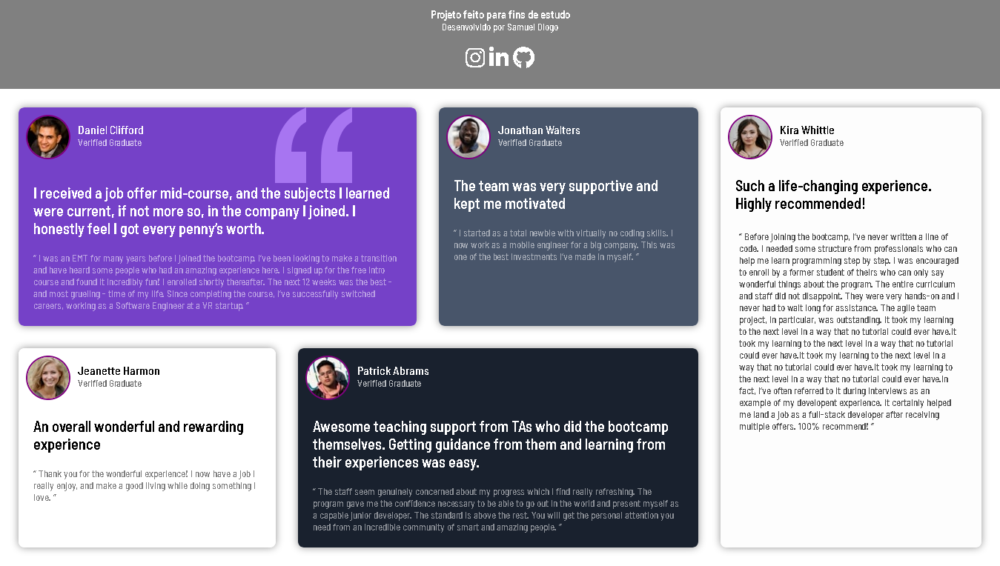

# Testimonials-Grid-Section
Testimonials grid section FrontendMentor - JUNIOR

-PROJETO FEITO PARA FINS DE ESTUDO.

## SLIDE

## SOBRE O DESAFIO 

Seu desafio é construir esta seção de grade de depoimentos e fazê-la parecer o mais próximo possível do design possível.

Você pode usar qualquer ferramenta que desejar para ajudá-lo a completar o desafio. Portanto, se você tem algo que gostaria de praticar, sinta-se à vontade para experimentar.

Seus usuários devem ser capazes de:

Visualize o layout ideal para o site, dependendo do tamanho da tela do dispositivo.

## RECURSO UTILIZADOS

- HTML, CSS
- PNG, SVG, JPG IMAGES.
